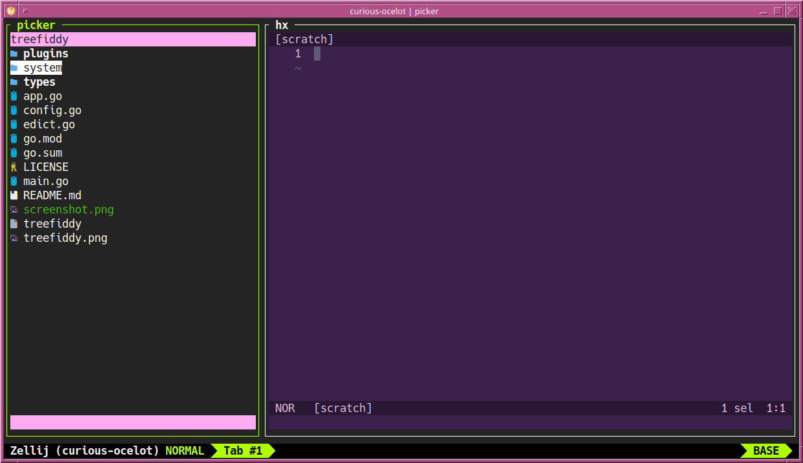

# treefiddy


**treefiddy** is a tree-centric and directory-rooted file explorer in the vein of an IDE's file browser/picker. Written so I could use as the file picker in [zide](https://github.com/josephschmitt/zide). Existing options didn't play well with mouse use and/or were only pseudo tree-based at best.



⚠  treefiddy is a work-in-progress and may have breaking changes at any point until official release.

## Features
  * Tree view rooted to path provided by the first argument or cwd.
    * Location can be updated via location navbar.
  * Double-click items to `edit` (open with $EDITOR)
  * Arrow keys/hjkl + enter to `edit` (open with $EDITOR)
  * Symlink following, wow!
  * Edicts, Actions, Binds, and Shortcuts
  * Plugins
    * JavaScript-based plugins systems for providing features such as sorting, nerd fonts, or git file status.
    * Flexible system for writing plugin systems for other languages.

## Configuration
Upon starting, `~/.config/treefiddy/config.yaml` (or whatever your XDG config dir is) is created with the defaults. See `config.go` for current options.

Plugins may also be configured via their `~/.config/treefiddy/plugins/<system>/<plugin>/config.yaml` file. A plugin's default configuration, if one exists, may be created by issuing the `plugin save <name>` edict.

## Edicts
Edicts are commands that are executed by user input or through other edicts or plugins. These are broadly location-aware, meaning they'll use the current selection location for directory unless absolute paths are given. For example, `edit foo.go` while in `my/dir` will resolve to `edit my/dir/foo.go`.

  * `edit` or `edit <file>`
    * Open file in the current `$EDITOR`
  * `open` or `open <file>`
    * Open file using `xdg-open` or `open`.
  * `create <file>`
    * Create a new file.
  * `rename <from> <to>` or `rename <selected to new name>`
    * Rename a file.
  * `trash` or `trash <file>`
    * Moves a file to the user's trash.

## Actions
Actions are mappings for particular picker actions to call edicts. These are defined in `config.actions` and are:

  * `click` for mouse click on a selection
  * `enter` for hitting enter on a selection
  * `post_edict_edicts` are a mapping of an edict to call after the completion of another edict. e.g., `edit` -> `create`

```yaml
actions:
  click: edit
  enter: open
```

## Binds
Binds are mappings from hotkeys to activate an edict. For example, the key `e` can be mapped to `edit` to cause that edict to trigger when that key is pressed in the tree list. These are defined in `config.binds` and consist of an array of bind entries.

```yaml
binds:
  - edict: edit
    rune: 101
```

## Shortcuts
Shortcuts are mappings of keywords to edicts. For example, the keyword `rm` can be used to refer to `remove`. These are defined in `config.shortcuts` and consist of an array of shortcut entries.

```yaml
shortcuts:
  - edict: remove
    keyword: rm
```

## Plugins
Plugins are provided by `System` implementations. These provide mechanisms for loading, unloading, and managing plugins.

Plugins themselves provide features such as sorting, filtering, colorizing, showing VCS file status, and more.

⚠  The plugin system and how it exposes features to plugins is very much in-development. Ideally it will provide a relatively sandboxed way to read/write/stat files and similar. At the moment plugins can use the `exec` host function which allows executing other programs. This is partially governed by the `permissions.exec` plugin field, however permissions are not yet implemented.

### JavaScript
The JavaScript plugin system uses [qjs](https://github.com/fastschema/qjs) to provide an easy method to writing and using plugins. See the `plugins/js` folder for more information on its functionality.
